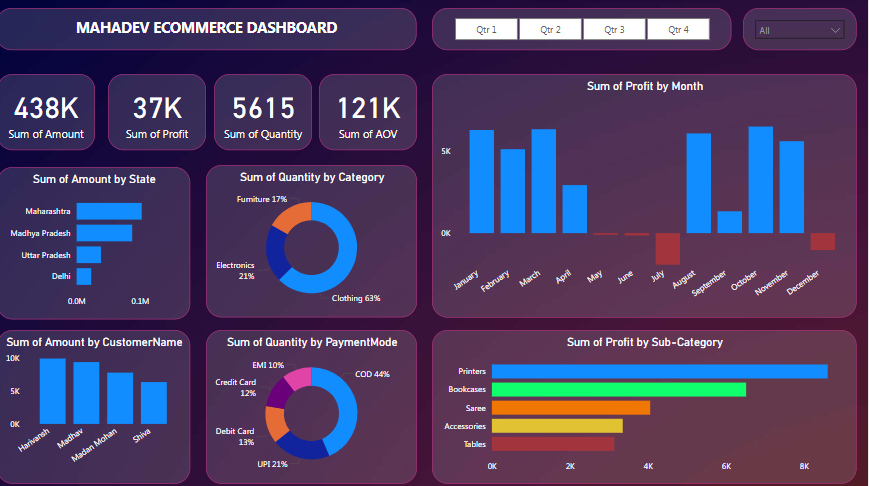

# 📊 Mahadev Ecommerce Dashboard - Power BI

## 🧾 Overview
This Power BI dashboard provides a comprehensive visualization of **Mahadev Ecommerce** sales and performance data. It is designed to help stakeholders analyze key business metrics, identify sales patterns, and make data-driven decisions.

---

## 📌 Key Highlights

- **Sum of Amount**: Rs.438K  
- **Sum of Profit**: Rs.37K  
- **Sum of Quantity**: 5615 Units  
- **Sum of AOV (Average Order Value)**: Rs.121K  

---

## 📊 Dashboard Sections

### 1. Sum of Amount by State
Visualizes total sales amount by Indian states such as:
- Maharashtra
- Madhya Pradesh
- Uttar Pradesh
- Delhi

### 2. Sum of Quantity by Category
A donut chart representing quantity sold by:
- Electronics (21%)
- Furniture (17%)
- Clothing (63%)

### 3. Sum of Profit by Month
Bar chart showing monthly profits, highlighting:
- Highest profits in **January, April, and October**
- Losses in **July, August, and December**

### 4. Sum of Amount by Customer Name
Top customers based on purchase amount:
- Hardik
- Manohar
- Madhavi Mohan
- Shilpa

### 5. Sum of Quantity by Payment Mode
Payment methods used:
- COD (44%)
- UPI (21%)
- Debit Card (13%)
- Credit Card (12%)
- EMI (10%)

### 6. Sum of Profit by Sub-Category
Most profitable sub-categories:
- Printers
- Bookcases
- Saree
- Accessories
- Tables

---

## 🕓 Filters/Controls
- Quarterly filters: **Qtr 1**, **Qtr 2**, **Qtr 3**, **Qtr 4**
- State Wise filter: **All**

---

## 🛠 Tools Used
- **Power BI**: For data visualization and dashboard creation  
- **CSV Source**:  source of raw ecommerce data

---

## 📈 Insights
- Clothing dominates in quantity sold.  
- COD is the most preferred payment method.  
- Profit dips observed in **July** and **December**.  
- Printers contribute the most to sub-category profit.

---

## 📚 Usage
This dashboard can be used by:
- Business Analysts for performance review  
- Marketing teams to plan promotions  
- Sales managers to understand customer behavior

---

## 📎 Screenshot

## 📎 Dashboard

---

## 📂 Files Included
- `MahadevDashboard.pbix` - Power BI project file
- `Details.csv` - Raw data source
- `orders.csv` - Raw data source
- `screenshot.png` - Dashboard image
- `README.md` - Documentation file

---

## 🚀 How to Use
1. Clone or download this repository.
2. Open the `.pbix` file using Power BI Desktop.
3. Load the CSV data if not already connected.
4. Explore and analyze the dashboard.

---

## 📬 Contact
For queries or suggestions, feel free to contact at: [dwivediaditya2322006@gmail.com]
